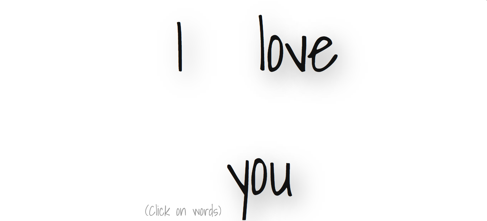
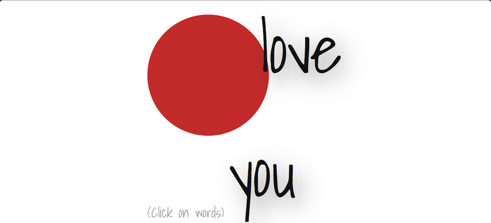
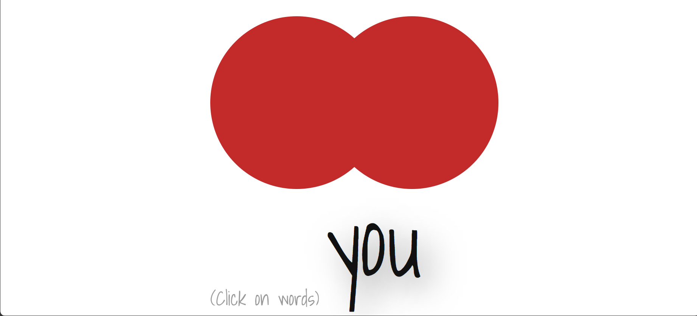
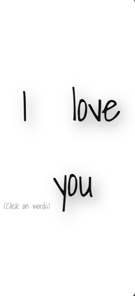
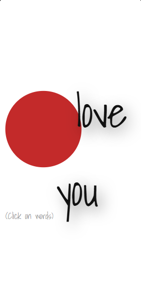
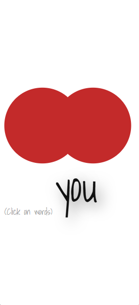
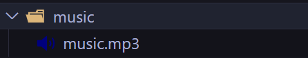

# 💌 Propose Your Crush 💕

A fun, romantic, and creative way to propose to your crush — not just by words, but with style and animation!  
Click on each word, and watch magic happen as they form a beating heart with background music that sets the mood. 💓

[🎬 Live Demo: https://arundada9000.github.io/words/](https://arundada9000.github.io/words/)

---

## 💻 Desktop Preview

---

## 📱 Mobile Preview

---

✨ When your crush clicks the words, the top two will turn into circles and the bottom one into a rotated rectangle — together forming a beautiful heart that throbs with love, along with soft background music. 🎶❤️

---

## 🛠️ How to Customize It

### 💖 Change the Words

1. Open the main HTML file (`index.html`).
2. Look for the section where the words are written.
3. Replace them with your own text (for example, her name or your message).

✅ Done! Now your custom message will form the heart.

---

### 🎵 Change the Music

1. Go to the `music` folder.
2. Replace the existing `music.mp3` file with your own romantic song.
3. Make sure to name it exactly `music.mp3` to work perfectly.

✅ Done! Your favorite song will now play in the background.

---

### 💞 Change the Name

You can also personalize it with your crush’s name:

1. Find the **`<h1>` or `
` tag** in your HTML that displays the name.
2. Replace the name with your crush’s name (or your own 😉).

---

## 🌸 Preview of the Animation

<!-- <video src="./preview/throbbing.mp4" width="500" controls alt="Throbbing video"></video> -->
<image src="./preview/throbbing.gif" alt="throbbing gif">

The heart pulses and glows beautifully while the background music plays, creating a perfect romantic vibe. 💗

---

## 🌐 Connect with Me

I'm always happy to collaborate on creative and fun web projects!  
Let’s connect 👇

 

---

_Made with ❤️ and a touch of courage._  
_Sometimes, code can say what words can’t._ 😅

Made By **Arun Neupane**  
**For educational purpose** on **Code With Ease** YouTube channel.

I hereby declare that anyone can use this code freely, but **images, music, and personal names** used here are **not for reuse or redistribution**.

---

🎥 **Tutorial Link:**   
📺 **My YouTube Channel:** [https://youtube.com/@arundada9000](https://youtube.com/@arundada9000)

